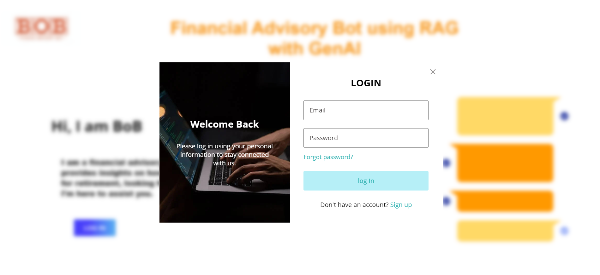

# Financial Advisory Bot with GenAI

This project aims to revolutionize financial advisory services by leveraging generative AI to provide personalized, data-driven financial advice. The application collects and processes financial data, performs hybrid searches using Azure Cognitive Services, and delivers responses through a user-friendly Flask application.

Web-App Video Link: <a href="https://drive.google.com/file/d/1W-Naj5z4EGK2QzWuOwBjRH879T2go4L8/view?usp=sharing">Click Here</a>

## Table of Contents

1. [Overview](#overview)
2. [Data Collection](#data-collection)
3. [Data Storage and Categorization](#data-storage-and-categorization)
4. [Azure Services Major Component Integration](#azure-services-major-component-integration)
5. [Hybrid Search Technique](#hybrid-search-technique)
6. [Application Deployment](#application-deployment)
7. [Sample Inputs and Use Cases](#sample-inputs-and-use-cases)
8. [How to Run the Application](#how-to-run-the-application)

## Overview

The project consists of the following components:
- **Data Collection**: Using web scraping tools and APIs to gather financial data.
- **Data Storage**: Organizing the collected data into structured JSON files and storing them in Azure Blob Storage.
- **AI Integration**: Utilizing Azure AI services and OpenAI models to create embeddings and deploy the advisory bot.
- **Search Mechanism**: Implementing a hybrid search technique combining vector and keyword searches.
- **User Interface**: Developing a Flask application to provide an interactive user experience.

## Data Collection

Data is collected using:
- **<a href="https://scrapegraphai.com/](https://github.com/ScrapeGraphAI/Scrapegraph-ai">ScrapeGraphAI</a>**: A tool for web scraping financial data.
- **<a href="https://finnhub.io/docs/api/introduction">Financial news API (Finhub.io)</a>**: For real-time financial news and updates.

The data is then stored in structured JSON files and categorized into four main types:
- General
- Loans
- Investments
- Insurance

## Data Storage and Categorization

### Categories

1. **General Data**: For supporting general queries related to various types of accounts.
    - Savings Accounts
    - Salary Accounts
    - Current Account
    - Term Deposit

2. **Loans**: Information and advice related to various loan products.
    - Home Loan
    - Vehicle Loan
    - Personal Loans
    - Education Loan
    - Gold Loan
    - Mortgage Loan

3. **Investments**: Guidance on different investment products and strategies.
    - Govt. Deposit Schemes/Bonds
    - Mutual funds and stocks

4. **Insurance**: Details and advice on various insurance policies.
    - General Insurance
    - Life Insurance
    - Health Insurance

### Sample Inputs and Use Cases

#### General Data
```
Personal Information:
- Age: 30
- Occupation: Graphic Designer
- Monthly Income: ₹80,000
- Monthly Expenses: ₹50,000
- Current Savings: ₹2,00,000
- Investment Goals: Buying a home, building an emergency fund
- Risk Tolerance: Low

Specific Details:
- Type of Financial Advice Needed: Investment planning
- Current Financial Products (if any): Savings account, PPF (Public Provident Fund)
- Any Debts or Loans: Yes
  - If yes, provide details: ₹15,00,000 in student loans, ₹15,000 monthly installment

Query:
- Please provide me with advice on how to start investing with low risk and how to save for a down payment on a house.
```

#### Loans
```
Personal Information:
- Age: 40
- Occupation: Marketing Manager
- Monthly Income: ₹1,20,000
- Monthly Expenses: ₹70,000
- Current Savings: ₹3,00,000
- Investment Goals: Children's education, retirement savings
- Risk Tolerance: Moderate

Loan Details:
- Item Type: Home
- Item Price: ₹50,00,000
- Loan Term: 20 years
- Interest Type: Fixed
- Interest Rate: 7.5%

Additional Information:
- Do you have any other outstanding loans? Yes
  - If yes, what is the monthly installment? ₹10,000 for a personal loan
- Credit Score: 750

Query:
- Please provide me with advice on whether this home loan is suitable for my financial situation and if there are any better alternatives.
```

#### Investments
```
Age: 35
Occupation: Software Engineer
Monthly Income: ₹150,000
Monthly Expenses: ₹70,000
Current Savings: ₹500,000
Investment Goals: Save for children's education and retirement
Risk Tolerance: Moderate
Time Horizon: 15 years
Preferred Investment Type: Mutual funds and stocks
Amount Available for Investment: ₹100,000
Other Investments: ₹200,000 in fixed deposits
Expected Returns: 10-12%

Please provide me with investment advice.

```

#### Insurance
```
Personal Information:
- Age: 35
- Occupation: Software Engineer
- Monthly Income: ₹1,50,000
- Monthly Expenses: ₹90,000
- Current Savings: ₹5,00,000
- Investment Goals: Retirement savings, children's education
- Risk Tolerance: Moderate
- Health Conditions (if applicable): None

Insurance Policy Details:
- Type of Insurance: Life Insurance
- Policy Name: Whole Life Protection Plan
- Sum Insured: ₹50,00,000
- Policy Term: 30 years
- Premium: ₹12,000 per year
- Coverage: Death benefit, terminal illness, accidental death
- Special Features: Cash value accumulation, loan facility
- Exclusions: Suicide within the first two years, pre-existing conditions not declared

Query:
- Please provide me with advice on whether this life insurance policy meets my long-term financial goals and if there are any better alternatives.
```

## Azure Services Major Component Integration

- **<a href="https://azure.microsoft.com/en-in/products/storage/blobs">Azure Blob Storage</a>**: Used for storing structured JSON files and embedding data.
- **<a href="https://learn.microsoft.com/en-us/azure/search/search-what-is-azure-search">Azure Cognitive Services</a>**: For implementing vector search capabilities.
- **<a href="https://azure.microsoft.com/en-in/products/ai-services/openai-service">OpenAI Services</a>**:
    - `text-embedding-ada-002`: For creating embeddings of the collected data.
    - `gpt-35-turbo-16k`: For generating responses based on user queries.
- **<a href="https://azure.microsoft.com/en-in/products/cosmos-db">Azure Cosmos DB</a>**: For storing Chat History, based on that giviing tailored response. 

## Hybrid Search Technique

The search functionality combines vector search and keyword search to provide accurate and relevant results. The steps involved are:
1. Create embeddings of the data using `text-embedding-ada-002`.
2. Store the embeddings in Azure Blob Storage.
3. Use Azure Cognitive Services to perform searches.
4. Combine vector search results with keyword search results for a comprehensive response.

## Application Deployment

The application is deployed using Azure OpenAI Service. The deployment process involves:
1. Creating an Azure Blob Storage account.
2. Setting up the data storage and embedding processes.
3. Implementing the hybrid search mechanism.
4. Developing a Flask application for the front end.

## How to Run the Application

1. **Access the Application**: Click on the <a href="https://atharvam-1732.github.io/TechX_BOB_Hackathon_20241/">application link</a> provided.<br><br>
2. **Home Page**: You will land on the home page.<br><br>
<div align="center">
    
    <p>Home Page</p>
</div>  
3. Login/Register: Click on the Login button. Currently, the bot is accessible to all users. Simply click on the Login text.<br><br>
<div align="center">
    
    <p>Login Page</p>
</div>
4. Navigation: You will be navigated to a page with five services: General, Loans, Investments, Insurance Bots, and one Calculator.<br><br>
<div align="center">
    
    <p>Choose your Service Page</p>
    <br>
</div>
5. Interact with the Bot: Ask your queries or use the sample inputs provided.<br><br>
<div align="center">
    
    <p>Bot Interface Page</p>
    
    <p>Calculator Page</p>
</div>
    
---
